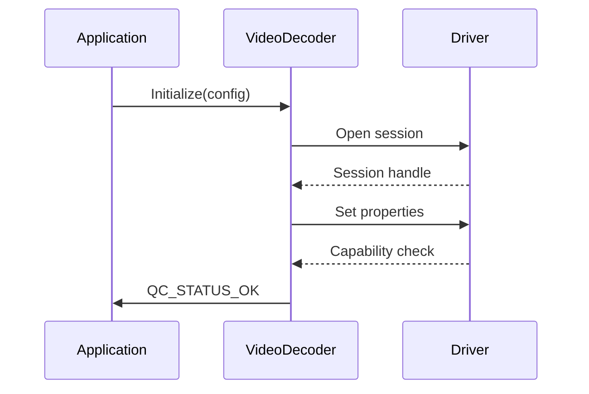
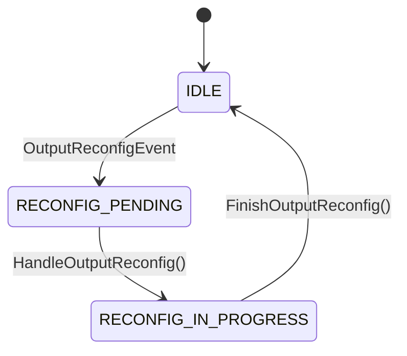

*Menu*:
- [1. Introduction](#1-introduction)
- [2. Video Decoder Configuration](#2-video-decoder-configuration)
  - [2.1 Video Decoder Node Configuration](#21-video-decoder-node-configuration)
- [3. QC VideoDecoder Data Structures](#3-qc-videodecoder-data-structures)
  - [3.1 The details of VideoFrameDescriptor\_t](#31-the-details-of-videoframedescriptor_t)
- [4. QC VideoDecoder APIs](#4-qc-videodecoder-apis)
- [5. Typical Use Case](#5-typical-use-case)
  - [5.1 Typical use case of dynamic mode](#51-typical-use-case-of-dynamic-mode)

# 1. Introduction
The QC VideoDecoder node provides APIs for video decoding. It calls vidc library to process video frames based on video hardware. 
This node supports QNX and HGY Linux/Ubuntu platforms.

# 2. Video Decoder Configuration

## 2.1 Video Decoder Node Configuration
| Parameter            | Required  | Type        | Default | Description            |
|----------------------|-----------|-------------|---------|------------------------|
| `name`               | true      | string      |         | The Node unique name.  |
| `id`                 | true      | uint32_t    |         | The Node unique ID.    |
| `width`              | true      | uint32_t    |         | Video frame width.     |
| `height`             | true      | uint32_t    |         | Video frame height.    |
| `frameRate`          | true      | uint32_t    |         | Frames per second.     |
| `format`             | false     | string      | h265    | The image format, options from [nv12, nv12_ubwc] |
| `output_format`      | false     | string      | nv12    | The output image format, options from [h264, h265] |
| `bInputDynamicMode`  | false     | bool        | true    | Input frame dynamic mode |
| `bOutputDynamicMode` | false     | bool        | false   | Output frame dynamic mode |
| `numInputBufferReq`  | false     | uint32_t    | 4       | Number of input buffers |
| `numOutputBufferReq` | false     | uint32_t    | 4       | Number of output buffers |

- Example Configurations
```json
{
    "static": {
        "name": "VDEC0",
        "id": 0,
        "width": 1920,
        "height": 1024,
        "frameRate": 30,
        "format": "h265",
        "output_format": "nv12",
        "bInputDynamicMode": true,
        "bOutputDynamicMode": false,
        "numOutputBufferReq": 4,
        "numInputBufferReq": 4,
    }
}
```
# 3. QC VideoDecoder Data Structures
- [VideoFrameDescriptor_t](../include/QC/Infras/Memory/VideoFrameDescriptor.hpp#L50)

## 3.1 The details of VideoFrameDescriptor_t
VideoFrameDescriptor_t contains all the parameters of input and output video frame:
- ImageDescriptor: Image buffer of input video frame
- timestampNs: Timestamp in nanoseconds of frame data
- appMarkData: Mark data of frame data
- frameType: Indication of I/P/B/IDR frame, used by encoder
- frameFlag: Indication of whether some error occurred during decoding this frame

# 4. QC VideoDecoder APIs

- [Initialize the VideoDecoder node](../include/QC/Node/VideoDecoder.hpp#L209)
- [Start the VideoDecoder pipeline](../include/QC/Node/VideoDecoder.hpp#L250)
- [Stop the VideoDecoder pipeline](../include/QC/Node/VideoDecoder.hpp#L251)
- [Submit Input and Output Frames to VideoDecoder](../include/QC/Node/VideoDecoder.hpp#L242)

## 4.1 VideoDecoder API Table of Contents

4.1.1. [Versioning](#42-versioning)
4.1.2. [Buffer Allocation Modes](#43-buffer-allocation-modes)
4.1.3. [Configuration Structures](#44-configuration-structures)
     - [VideoDecoder_Config_t](#441-videodecoder_config_t)
4.1.4. [Configuration Interface](#45-configuration-interface)
     - [VideoDecoderConfigIfs](#451-videodecoderconfigifs)
4.1.5. [Main Decoder Class](#46-main-decoder-class)
     - [Initialization Sequence](#4611-initialization-sequence)
     - [Frame Processing](#4612-frame-processing)
     - [Dynamic Reconfiguration](#4613-dynamic-reconfiguration)
     - [State Management](#4614-state-management)
4.1.6. [Error Handling](#47-error-handling)
4.1.7. [Thread Safety](#48-thread-safety)

## 4.2 Versioning

| Component | Value   | Description                  |
|-----------|---------|------------------------------|
| MAJOR     | 2       | Major architecture changes   |
| MINOR     | 0       | Backward-compatible features |
| PATCH     | 0       | Bug fixes                    |
| HEX       | 0x20000 | Combined version identifier  |

All API compatibility guarantees are tied to this version number

## 4.3 Buffer Allocation Modes

**Three distinct buffer management strategies**:

| Mode | Description | Configuration | When to Use |
|------|-------------|---------------|-------------|
| **Dynamic (Mode 1)** | Application allocates and submits buffers at runtime | `inputDynamicMode=true`, `outputDynamicMode=true` | Streaming applications with variable frame sizes |
| **Non-Dynamic (App Allocates - Mode 2)** | Application pre-allocates buffers and registers them during init | `inputDynamicMode=false`, `bufferList` provided | Memory-constrained systems with predictable workloads |
| **Non-Dynamic (Component Allocates - Mode 3)** | Component allocates buffers based on requested counts | `inputDynamicMode=false`, `bufferList=nullptr`, `numInputBufferReq` specified | Simplified integration for standard workflows |

> **Critical Constraint**: Mode 2 requires buffer list pointer to be non-null with sufficient capacity (`bufferList.len() >= numInputBufferReq`)

## 4.4 Configuration Structures

### 4.4.1 VideoDecoder_Config_t

**Inheritance**: `public VidcNodeBase_Config_t`

```cpp
struct VideoDecoder_Config {
    // Inherited from VidcNodeBase_Config_t:
    uint32_t width;            // Input frame width (pixels)
    uint32_t height;           // Input frame height (pixels)
    uint32_t frameRate;        // Frames per second (numerator)
    uint32_t frameRateDenom;   // Frame rate denominator (usually 1)
    bool inputDynamicMode;     // Buffer allocation mode (true = dynamic)
    bool outputDynamicMode;    // Output buffer allocation mode
    uint32_t numInputBuffers;  // Pre-allocated input buffers count
    uint32_t numOutputBuffers; // Pre-allocated output buffers count
    uint32_t inFormat;         // Input bitstream format (H.264=0, HEVC=1)
    uint32_t outFormat;        // Output format (NV12=0, NV12_UBWC=1, P010=2)
};
```

**Configuration Requirements**:
- `width`/`height` must be multiples of 32 for UBWC formats
- `frameRate` numerator must be ≤ 120
- `outFormat` must match hardware capabilities (P010 requires 10-bit capable hardware)

## 4.5 Configuration Interface

### 4.5.1 VideoDecoderConfigIfs

**Purpose**: Runtime configuration management

#### 4.5.1.1 Method: `VerifyAndSet(const std::string config, std::string &errors)`

**Parameters**:
- `config`: JSON configuration string
- `errors`: Output error messages (non-empty on failure)

**Return**: `QC_STATUS_OK` (0) on success, error code otherwise

**Configuration Schema**:
```json
{
  "static": {
    "name": "string (max 32 chars)",
    "id": "uint32_t (unique identifier)",
    "width": "uint32_t (32-aligned)",
    "height": "uint32_t (32-aligned)",
    "frameRate": "uint32_t (1-120)",
    "inputDynamicMode": "boolean",
    "outputDynamicMode": "boolean",
    "numInputBufferReq": "uint32_t (≥ 4)",
    "numOutputBufferReq": "uint32_t (≥ 8)",
    "inFormat": "uint32_t (H264=0, HEVC=1)",
    "outFormat": "uint32_t (NV12=0, NV12_UBWC=1, P010=2)"
  }
}
```

**Validation Rules**:
1. Resolution must match codec profile capabilities
2. Buffer counts must meet minimum requirements (input ≥ 4, output ≥ 8)
3. Dynamic mode changes require decoder in IDLE state

#### 4.5.1.2 Method: `GetOptions()`

**Returns**: JSON schema string for valid configurations

```json
{
  "static": {
    "width": {"min": 128, "max": 8192, "step": 32},
    "height": {"min": 128, "max": 4320, "step": 32},
    "frameRate": {"min": 1, "max": 120},
    "numInputBufferReq": {"min": 4},
    "numOutputBufferReq": {"min": 8}
  }
}
```

## 4.6 Main Decoder Class

### 4.6.1 VideoDecoder

**Inheritance**: `public VidcNodeBase`

#### 4.6.1.1 Initialization Sequence



**Critical Steps**:
1. Validate configuration via `ValidateConfig()`
2. Negotiate hardware capabilities
3. Configure buffer allocation strategy
4. Establish callback handlers

#### 4.6.1.2 Frame Processing

**Method**: `ProcessFrameDescriptor(QCFrameDescriptorNodeIfs &frameDesc)`

**Workflow**:
1. Submit bitstream frame via `SubmitInputFrame()`
2. Driver processes frame asynchronously
3. Decoded frame returned via `OutFrameCallback()`
4. Status reported via `EventCallback()`

**Buffer Channels**:
| Buffer ID | Numeric Value | Data Flow | Required Buffer Type |
|-----------|---------------|-----------|----------------------|
| `QC_NODE_VIDEO_DECODER_INPUT_BUFF_ID` | 0 | Input → Decoder | `VideoFrameDescriptor` (bitstream) |
| `QC_NODE_VIDEO_DECODER_OUTPUT_BUFF_ID` | 1 | Decoder → Output | `VideoFrameDescriptor` (YUV) |
| `QC_NODE_VIDEO_DECODER_EVENT_BUFF_ID` | 2 | Decoder → Application | `VideoDecoder_EventType_e` |

**Usage Example**:
```cpp
// Submit encoded bitstream
auto& inputBuf = frameDesc.GetBuffer(QC_NODE_VIDEO_DECODER_INPUT_BUFF_ID);
inputBuf.SetData(bitstreamData, frameSize);

// Retrieve decoded frame
auto& outputBuf = frameDesc.GetBuffer(QC_NODE_VIDEO_DECODER_OUTPUT_BUFF_ID);
const uint8_t* yuvData = outputBuf.GetData();
```

#### 4.6.1.3 Dynamic Reconfiguration

**Purpose**: Handle resolution/format changes mid-stream (e.g., adaptive streaming)

**State Machine**:


**Critical Methods**:
- `HandleOutputReconfig()`: Processes reconfiguration event
- `FinishOutputReconfig()`: Completes reconfiguration sequence

**Thread Safety**: Protected by `m_reconfigMutex`

#### 4.6.1.4 State Management

**State Transitions**:
| Current State | Allowed Operation | Next State |
|---------------|-------------------|------------|
| INITIAL       | Initialize()      | IDLE       |
| IDLE          | Start()           | RUNNING    |
| RUNNING       | Stop()            | IDLE       |
| RUNNING       | OutputReconfigEvent | RECONFIG_PENDING |
| RECONFIG_PENDING | HandleOutputReconfig() | RECONFIG_IN_PROGRESS |
| RECONFIG_IN_PROGRESS | FinishOutputReconfig() | IDLE |

## 4.7 Error Handling

**Common Status Codes**:
| Code | Name | Resolution |
|------|------|------------|
| 0x00 | QC_STATUS_OK | Operation succeeded |
| 0x01 | QC_STATUS_FAIL | Hardware error - check driver logs |
| 0x02 | QC_STATUS_UNSUPPORTED | Invalid configuration - verify codec/format |
| 0x03 | QC_STATUS_INVALID_PARAM | Configuration out of bounds |
| 0x04 | QC_STATUS_BUSY | Decoder busy - wait for IDLE state |
| 0x05 | QC_STATUS_TIMEOUT | Driver communication timeout |

**Reconfiguration Errors**:
- `QC_STATUS_RECONFIG_PENDING`: Output reconfiguration in progress
- `QC_STATUS_RESOLUTION_CHANGED`: Resolution change detected

**Error Recovery**:
1. Check `errors` string from configuration APIs
2. Verify hardware availability via `GetState()`
3. For reconfiguration errors:
   ```cpp
   if (status == QC_STATUS_RECONFIG_PENDING) {
       decoder->HandleOutputReconfig();
       // Wait for new buffers
       decoder->FinishOutputReconfig();
   }
   ```

## 4.8 Thread Safety

**Critical Sections**:
- Configuration changes (protected by internal mutexes)
- Reconfiguration state (protected by `m_reconfigMutex`)
- Frame submission queue

**Safe Usage Patterns**:
```cpp
// Thread-safe frame submission
std::lock_guard lock(decoder->GetMutex());
decoder->ProcessFrameDescriptor(frameDesc);

// Reconfiguration handling
void HandleEvent(VideoDecoder_EventType_e event) {
    if (event == VIDEO_DECODER_EVENT_OUTPUT_RECONFIG) {
        decoder->HandleOutputReconfig();
        // Allocate new output buffers
        decoder->FinishOutputReconfig();
    }
}
```

**Deadlock Prevention**:
- Never call decoder APIs from callback context
- Complete reconfiguration sequence before submitting new frames
- Configuration changes require IDLE state

# 5. Typical Use Case

## 5.1 Typical use case of dynamic mode

- Step 1: Configure parameters
```c++
QCStatus_e ret;
char pName[20] = "VidcDecoder";
uint32_t bufferNum = 4;
uint32_t frameNum = 10;

VideoDecoder vidcDecoder;
VideoDecoder_Config_t vidcDecoderConfig;
vidcDecoderConfig.bInputDynamicMode = true;
vidcDecoderConfig.bOutputDynamicMode = true;
vidcDecoderConfig.numInputBuffer = bufferNum;
vidcDecoderConfig.numOutputBuffer = bufferNum;

ImageProps_t inputImgProps;
inputImgProps.batchSize = 1;
inputImgProps.width = 1920;
inputImgProps.height = 1024;
inputImgProps.numPlanes = 1;
inputImgProps.planeBufSize[0] = 2961408;
inputImgProps.format = QC_IMAGE_FORMAT_COMPRESSED_H265;

vidcDecoderConfig.width = 1920;
vidcDecoderConfig.height = 1024;
vidcDecoderConfig.inFormat = QC_IMAGE_FORMAT_COMPRESSED_H265;
vidcDecoderConfig.outFormat = QC_IMAGE_FORMAT_NV12;
vidcDecoderConfig.frameRate = 30;
vidcDecoderConfig.pInputBufferList = nullptr;
vidcDecoderConfig.pOutputBufferList = nullptr;

// Define callback:
void OnDoneCb( conVideoCodec_EventType_e eventId, const void *pEvent, void *pPrivData ) {}
```

- Step 2: Allocate buffers
```c++
    ret = m_imagePool.Init( name, m_nodeId, LOGGER_LEVEL_INFO, m_numOutputBufferReq, m_width,
                            m_height, m_outFormat, QC_MEMORY_ALLOCATOR_DMA_GPU );

    if ( QC_STATUS_OK == ret )
    {
        ret = m_imagePool.GetBuffers( m_nodeCfg.buffers );
    }

```

- Step 3: Init and Register callback
```c++

using std::placeholders::_1;
m_nodeCfg.config = m_dataTree.Dump();
m_nodeCfg.callback = std::bind( &SampleVideoDecoder::OnDoneCb, this, _1 );

ret = m_decoder.Initialize( m_nodeCfg );
```

- Step 4: Submit input/output frame
```c++
for ( uint32_t i = 0; i < bufferNum; i++ )
{
    inputs[bufferIdx].timestampNs = frameInfo.startTime;
    inputs[bufferIdx].appMarkData = i;

    ret = inFrameDesc.SetBuffer( QC_NODE_VIDEO_DECODER_INPUT_BUFF_ID, inputs[bufferIdx] );
    ASSERT_EQ( QC_STATUS_OK, ret );
    //  Process the frame
    ret = pNodeVide->ProcessFrameDescriptor( inFrameDesc );
    ASSERT_EQ( QC_STATUS_OK, ret );

    std::unique_lock<std::mutex> outLock( g_OutMutex );
    g_OutCondVar.wait( outLock );

    //  Set up an output buffer for the frame
    ret = outFrameDesc.SetBuffer( QC_NODE_VIDEO_DECODER_OUTPUT_BUFF_ID, outputs[bufferIdx] );
    ASSERT_EQ( QC_STATUS_OK, ret );
    //  Process the frame
    ret = pNodeVide->ProcessFrameDescriptor( outFrameDesc );
    ASSERT_EQ( QC_STATUS_OK, ret );
}
```

- Step 5: Stop and deinitialize the pipeline
```c++
ret = vidcDecoder.Stop();
ret = vidcDecoder.Deinit();

for ( auto &output : outputs )
{
    ret = bufMgr.Free( output );
    ASSERT_EQ( QC_STATUS_OK, ret );
}

for ( auto &input : inputs )
{
    ret = bufMgr.Free( input );
    ASSERT_EQ( QC_STATUS_OK, ret );
}
```
