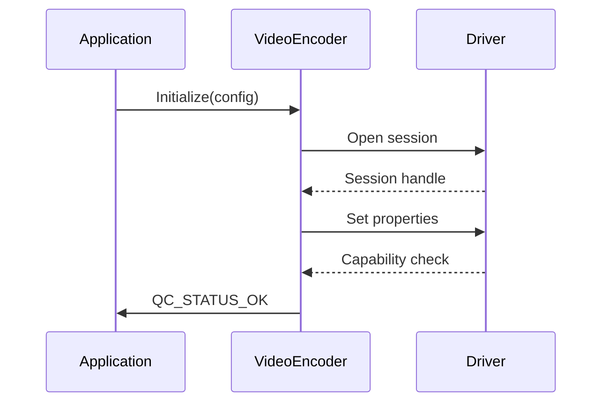
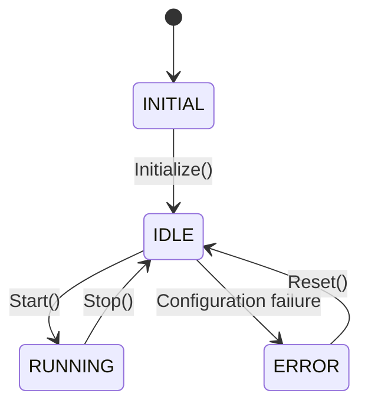

*Menu*:
- [1. Introduction](#1-introduction)
- [2. QC VideoEncoder Data Structures](#2-qc-videoencoder-data-structures)
  - [2.1 The details of image properties.](#21-the-details-of-videoframedescriptor_t)
- [3. Video Encoder Configuration](#3-video-encoder-configuration)
  - [3.1 Video Encoder Node Configuration](#31-video-encoder-node-configuration)
- [4. QC Video Encoder APIs](#4-qc-videoencoder-apis)
- [5. Typical VideoEncoder Use Case](#5-typical-videoencoder-use-cases)
  - [5.1 Dynamic input/output buffer](#51-dynamic-inputoutput-buffer)
  - [5.2 Non-Dynamic input/output buffer](#52-non-dynamic-inputoutput-buffer)
    - [5.2.1 set input/output buffer by config](#521-set-inputoutput-buffer-by-config)

# 1. Introduction
The QC VideoEncoder node provides APIs for video encoding. It calls vidc library to process video frames based on video hardware. 
This node supports QNX and HGY Linux/Ubuntu platforms.

# 2. QC VideoEncoder Data Structures

- [VideoFrameDescriptor_t](../include/QC/Infras/Memory/VideoFrameDescriptor.hpp#L50)

## 2.1 The details of VideoFrameDescriptor_t
VideoFrameDescriptor_t contains all the parameters of input and output video frame:
- ImageDescriptor: Image buffer of input video frame
- timestampNs: Timestamp in nanoseconds of frame data
- appMarkData: Mark data of frame data
- frameType: Indication of I/P/B/IDR frame, used by encoder
- frameFlag: Indication of whether some error occurred during decoding this frame

# 3. Video Encoder Configuration

## 3.1 Video Encoder Node Configuration
| Parameter            | Required  | Type        | Default | Description            |
|----------------------|-----------|-------------|---------|------------------------|
| `name`               | true      | string      |         | The Node unique name.  |
| `id`                 | true      | uint32_t    |         | The Node unique ID.    |
| `width`              | true      | uint32_t    |         | Video frame width.     |
| `height`             | true      | uint32_t    |         | Video frame height.    |
| `frameRate`          | true      | uint32_t    |         | Frames per second.     |
| `bitrate`            | false     | uint32_t    | 8000000 | The encoding bitrate   |
| `gop`                | false     | uint32_t    | 0       |                        |
| `rateControlMode`    | false     | string      | CBR_CFR | Bit rate control profile
| `format`             | false     | string      | nv12    | The image format, options from [nv12, nv12_ubwc] |
| `output_format`      | false     | string      | h265    | The output image format, options from [h264, h265] |
| `bInputDynamicMode`  | false     | bool        | true    | Input frame dynamic mode |
| `bOutputDynamicMode` | false     | bool        | false   | Output frame dynamic mode |
| `numInputBufferReq`  | false     | uint32_t    | 4       | Number of input buffers |
| `numOutputBufferReq` | false     | uint32_t    | 4       | Number of output buffers |

- Example Configurations
```json
{
    "static": {
        "name": "VENC0",
        "id": 0,
        "width": 1920,
        "height": 1024,
        "rateControlMode": "CBR_CFR",
        "gop": 20,
        "bitrate": 64000,
        "frameRate": 30,
        "format": "nv12",
        "output_format": "h265",
        "bInputDynamicMode": true,
        "bOutputDynamicMode": false,
        "numOutputBufferReq": 4,
        "numInputBufferReq": 4,
    }
}
```

# 4. QC VideoEncoder APIs

- [Init the video encoder](../include/QC/Node/VideoEncoder.hpp#L275)
- [Start the video encoder](../include/QC/Node/VideoEncoder.hpp#L316)
- [Stop the video encoder](../include/QC/Node/VideoEncoder.hpp#L317)
- [Submit Input and Output Frame](../include/QC/Node/VideoEncoder.hpp#L308)

## 4.1 VideoEncoder API Table of Contents

4.1.1. [Versioning](#42-versioning)
4.1.2. [Core Enumerations](#43-core-enumerations)
     - [Rate Control Modes](#431-rate-control-modes)
     - [Encoder Profiles](#432-encoder-profiles)
     - [Frame Types](#433-frame-types)
     - [Buffer Identifiers](#434-buffer-identifiers)
4.1.3. [Configuration Structures](#44-configuration-structures)
     - [VideoEncoder_Config_t](#441-videoencoder_config_t)
     - [VidcEncoderData_t](#442-vidcencoderdata_t)
4.1.4. [Configuration Interface](#45-configuration-interface)
     - [VideoEncoderConfigIfs](#451-videoencoderconfigifs)
4.1.5. [Main Encoder Class](#46-main-encoder-class)
     - [Initialization Sequence](#4611-initialization-sequence)
     - [Frame Processing](#4612-frame-processing)
     - [State Management](#4613-state-management)
4.1.6. [Error Handling](#47-error-handling)
4.1.7. [Thread Safety](#48-thread-safety)

## 4.2 Versioning

| Component | Value   | Description                  |
|-----------|---------|------------------------------|
| MAJOR     | 2       | Major architecture changes   |
| MINOR     | 0       | Backward-compatible features |
| PATCH     | 0       | Bug fixes                    |
| HEX       | 0x20000 | Combined version identifier  |

All API compatibility guarantees are tied to this version number

## 4.3 Core Enumerations

### 4.3.1 Rate Control Modes 

Struct `VideoEncoder_RateControlMode_e`

**Purpose**: Controls bitrate management strategy

| Enum Value                  | VIDC Equivalent             | Use Case             | Critical Parameters                   |
|-----------------------------|-----------------------------|----------------------|---------------------------------------|
| `VIDEO_ENCODER_RCM_CBR_CFR` | `VIDC_RATE_CONTROL_CBR_CFR` | Broadcast streaming  | Fixed bitrate, constant frame rate    |
| `VIDEO_ENCODER_RCM_CBR_VFR` | `VIDC_RATE_CONTROL_CBR_VFR` | Video conferencing   | Fixed bitrate, variable frame rate    |
| `VIDEO_ENCODER_RCM_VBR_CFR` | `VIDC_RATE_CONTROL_VBR_CFR` | Video-on-demand      | Variable bitrate, constant frame rate |
| `VIDEO_ENCODER_RCM_VBR_VFR` | `VIDC_RATE_CONTROL_VBR_VFR` | Storage optimization | Variable bitrate, variable frame rate |
| `VIDEO_ENCODER_RCM_UNUSED`  | `VIDC_RATE_CONTROL_UNUSED`  | Error state          | Invalid configuration                |

> **Implementation Note**: CBR modes require `bitRate` configuration. VBR modes use `bitRate` as maximum threshold.

### 4.3.2 Encoder Profiles 

Struct `VideoEncoder_Profile_e`

**Purpose**: Defines codec conformance points

| Profile | Supported Codecs | Bit Depth | Chroma Format | Max Resolution |
|---------|------------------|-----------|---------------|----------------|
| `H264_BASELINE` | H.264 | 8-bit | 4:2:0 | 1080p |
| `H264_MAIN` | H.264 | 8-bit | 4:2:0 | 1080p |
| `H264_HIGH` | H.264 | 8-bit | 4:2:0 | 4K |
| `HEVC_MAIN` | HEVC | 8-bit | 4:2:0 | 8K |
| `HEVC_MAIN10` | HEVC | 10-bit | 4:2:0/4:2:2 | 8K |

> **Hardware Note**: HEVC_MAIN10 requires Adreno GPU with 6xx+ series

### 4.3.3 Frame Types

Struct `VideoEncoder_FrameType_e`

**Purpose**: Identifies frame characteristics in callback events

| Type | Equivalent | Encoder Behavior | Typical Use |
|------|------------|------------------|-------------|
| `VIDEO_ENCODER_FRAME_I` | `VIDC_FRAME_I` | Key frame | Scene changes |
| `VIDEO_ENCODER_FRAME_P` | `VIDC_FRAME_P` | Predictive frame | Standard encoding |
| `VIDEO_ENCODER_FRAME_B` | `VIDC_FRAME_B` | Bi-directional frame | High-efficiency mode |
| `VIDEO_ENCODER_FRAME_IDR` | `VIDC_FRAME_IDR` | Instant decoder refresh | Stream recovery |
| `VIDEO_ENCODER_FRAME_NOTCODED` | `VIDC_FRAME_NOTCODED` | Skipped frame | Low-motion scenes |
| `VIDEO_ENCODER_FRAME_YUV` | `VIDC_FRAME_YUV` | Raw input frame | Pre-processing |

### 4.3.4 Buffer Identifiers 

Struct `VideoEncoderBufferId_e`

**Purpose**: Channel selection for frame descriptor operations

| Buffer ID | Numeric Value | Data Flow | Required Buffer Type |
|------------|---------------|-----------|----------------------|
| `QC_NODE_VIDEO_ENCODER_INPUT_BUFF_ID` | 0 | Input → Encoder | `VideoFrameDescriptor` (YUV) |
| `QC_NODE_VIDEO_ENCODER_OUTPUT_BUFF_ID` | 1 | Encoder → Output | `VideoFrameDescriptor` (bitstream) |
| `QC_NODE_VIDEO_ENCODER_EVENT_BUFF_ID` | 2 | Encoder → Application | `VideoEncoder_EventType_e` |

## 4.4 Configuration Structures

### 4.4.1 VideoEncoder_Config_t

**Inheritance**: `public VidcNodeBase_Config_t`

```cpp
struct VideoEncoder_Config {
    uint32_t bitRate;          // Target bitrate (bps)
    uint32_t gop;              // Group of Pictures size (P-frame count)
    bool bSyncFrameSeqHdr;     // Enable sequence headers in every keyframe
    VideoEncoder_RateControlMode_e rateControlMode;
    VideoEncoder_Profile_e profile;
    
    // Inherited from VidcNodeBase_Config_t:
    uint32_t width;            // Input frame width (pixels)
    uint32_t height;           // Input frame height (pixels)
    uint32_t frameRate;        // Frames per second (numerator)
    uint32_t frameRateDenom;   // Frame rate denominator (usually 1)
    bool inputDynamicMode;     // Buffer allocation mode (true = framework allocates)
    bool outputDynamicMode;    // Output buffer allocation mode
    uint32_t numInputBuffers;  // Pre-allocated input buffers count
    uint32_t numOutputBuffers; // Pre-allocated output buffers count
};
```

**Configuration Requirements**:
- `width`/`height` must be multiples of 32 for UBWC formats
- `gop` = 0 disables B-frames (I/P only)
- `bSyncFrameSeqHdr` required for streaming protocols (RTMP, HLS)

### 4.4.2 VidcEncoderData_t

**Internal State Structure** (Exposed via monitoring interface)

```cpp
struct VidcEncoderData_t {
    vidc_profile_type profile;      // Active codec profile
    vidc_level_type level;          // Derived from resolution/framerate
    vidc_frame_rate_type frameRate; // Actual encoder framerate
    vidc_iperiod_type iPeriod;      // I-frame interval (gop+1)
    vidc_idr_period_type idrPeriod;// IDR frame interval
    vidc_target_bitrate_type bitrate;
    vidc_enable_type enableSyncFrameSeq;
    vidc_plane_def_type planeDefY;  // Y-plane memory layout
    vidc_plane_def_type planeDefUV; // UV-plane memory layout
};
```

> **Note**: This structure is updated during `Initialize()` and reflects actual hardware capabilities

## 4.5 Configuration Interface

### 4.5.1 VideoEncoderConfigIfs

**Purpose**: Runtime configuration management

#### 4.5.1.1 Method: `VerifyAndSet(const std::string config, std::string &errors)`

**Parameters**:
- `config`: JSON configuration string
- `errors`: Output error messages (non-empty on failure)

**Return**: `QC_STATUS_OK` (0) on success, error code otherwise

**Configuration Schema**:
```json
{
  "static": {
    "name": "string (max 32 chars)",
    "id": "uint32_t (unique identifier)",
    "width": "uint32_t (32-aligned)",
    "height": "uint32_t (32-aligned)",
    "bitRate": "uint32_t (>= 100000)",
    "frameRate": "uint32_t (1-120)",
    "gop": "uint32_t (0-255)",
    "inputDynamicMode": "boolean",
    "outputDynamicMode": "boolean",
    "rateControlMode": "string (CBR_CFR|CBR_VFR|VBR_CFR)",
    "profile": "string (H264_BASELINE|HEVC_MAIN10)",
    "inFormat": "uint32_t (NV12=0, P010=1)",
    "outFormat": "uint32_t (H264=0, HEVC=1)"
  },
  "dynamic": {
    "bitRate": "uint32_t (runtime change)",
    "frameRate": "uint32_t (runtime change)"
  }
}
```

**Validation Rules**:
1. Resolution must match hardware capabilities
2. Bitrate must be within codec profile limits
3. GOP size ≤ 255 for H.264, ≤ 128 for HEVC
4. Dynamic changes require encoder in IDLE state

#### 4.5.1.2 Method: `GetOptions()`

**Returns**: JSON schema string for valid configurations

```json
{
  "static": {
    "width": {"min": 128, "max": 8192, "step": 32},
    "height": {"min": 128, "max": 4320, "step": 32},
    "bitRate": {"min": 100000, "max": 100000000},
    ...
  }
}
```

## 4.6 Main Encoder Class

### 4.6.1 VideoEncoder

**Inheritance**: `public VidcNodeBase`

#### 4.6.1.1 Initialization Sequence



**Critical Steps**:
1. Validate configuration via `ValidateConfig()`
2. Negotiate hardware capabilities via `GetInputInformation()`
3. Configure driver properties through `InitDrvProperty()`
4. Establish callback handlers

#### 4.6.1.2 Frame Processing

**Method**: `ProcessFrameDescriptor(QCFrameDescriptorNodeIfs &frameDesc)`

**Workflow**:
1. Submit input frame via `SubmitInputFrame()`
2. Driver processes frame asynchronously
3. Output frame returned via `OutFrameCallback()`
4. Status reported via `EventCallback()`

**Thread Safety**: 
- ❌ Not thread-safe (requires external synchronization)
- ✅ Callbacks executed on driver thread

**Buffer Management**:
```cpp
// Input frame submission
auto& inputBuf = frameDesc.GetBuffer(QC_NODE_VIDEO_ENCODER_INPUT_BUFF_ID);
inputBuf.SetData(yuvData, frameSize);

// Output frame retrieval
auto& outputBuf = frameDesc.GetBuffer(QC_NODE_VIDEO_ENCODER_OUTPUT_BUFF_ID);
const uint8_t* bitstream = outputBuf.GetData();
```

#### 4.6.1.3 State Management

**State Machine**:


**State Transitions**:
| Current State | Allowed Operation | Next State |
|---------------|-------------------|------------|
| INITIAL       | Initialize()      | IDLE       |
| IDLE          | Start()           | RUNNING    |
| RUNNING       | Stop()            | IDLE       |
| IDLE          | Initialize()      | ERROR      |
| ERROR         | Reset()           | IDLE       |

## 4.7 Error Handling

**Common Status Codes**:
| Code | Name | Resolution |
|------|------|------------|
| 0x00 | QC_STATUS_OK | Operation succeeded |
| 0x01 | QC_STATUS_FAIL | Hardware error - check driver logs |
| 0x02 | QC_STATUS_UNSUPPORTED | Invalid configuration - verify profile/resolution |
| 0x03 | QC_STATUS_INVALID_PARAM | Configuration out of bounds |
| 0x04 | QC_STATUS_BUSY | Encoder busy - wait for IDLE state |
| 0x05 | QC_STATUS_TIMEOUT | Driver communication timeout |

**Error Recovery**:
1. Check `errors` string from configuration APIs
2. Verify hardware availability via `GetState()`
3. Reset encoder through `Stop()` → `Reset()` sequence

## 4.8 Thread Safety

**Critical Sections**:
- Configuration changes (protected by `m_configMutex`)
- Frame submission queue (protected by `m_frameQueueMutex`)

**Safe Usage Patterns**:
```cpp
// Thread-safe frame submission
std::lock_guard lock(encoder->GetMutex());
encoder->ProcessFrameDescriptor(frameDesc);

// Callback handling (automatic)
void MyCallback(QCFrameDescriptorNodeIfs& result) {
    // Process output on driver thread
    // MUST NOT call encoder APIs directly
    PostToMainThread(result);
}
```

**Deadlock Prevention**:
- Never call encoder APIs from callback context
- Use asynchronous notification for result processing
- Configuration changes require IDLE state

# 5. Typical VideoEncoder Use Cases

- [gtest_VideoEncoder](../tests/unit_test/Node/VideoEncoder/gtest_VideoEncoder.cpp)
- [SampleVideoEncoder](../tests/sample/source/SampleVideoEncoder.cpp)

## 5.1 Dynamic input/output buffer
```c++
//...
    QCStatus_e ret;
    std::string errors;
    BufferManager bufMgr = BufferManager( { "VENC", QC_NODE_TYPE_VENC, 0 } );
    QCNodeIfs *pNodeVide = new QC::Node::VideoEncoder();
    DataTree dt;
    dt.Set<std::string>( "name", "SANITY_VideoEncoder_Dynamic" );
    dt.Set<uint32_t>( "id", g_nodeId = 1 );
    dt.Set<std::string>( "logLevel", "ERROR" );
    dt.Set<uint32_t>( "width", 176 );
    dt.Set<uint32_t>( "height", 144 );
    dt.Set<uint32_t>( "bitrate", 64000 );
    dt.Set<uint32_t>( "gop", 20 );
    dt.Set<bool>( "bInputDynamicMode", true );
    dt.Set<bool>( "bOutputDynamicMode", true );
    dt.Set<uint32_t>( "numInputBufferReq", 4 );
    dt.Set<uint32_t>( "numOutputBufferReq", 4 );
    dt.Set<uint32_t>( "frameRate", 30 );
    dt.Set<std::string>( "profile", "H264_MAIN" );
    dt.Set<std::string>( "rateControlMode", "CBR_CFR" );
    dt.Set<std::string>( "inputImageFormat", "nv12" );
    dt.Set<std::string>( "outputImageFormat", "h264" );

    DataTree dataTree;
    dataTree.Set( "static", dt );

    QCNodeInit_t config = { .config = dataTree.Dump(), .callback = OnDoneCb };

    ret = pNodeVide->Initialize( config );
    ASSERT_EQ( QC_STATUS_OK, ret );
    ASSERT_EQ( QC_OBJECT_STATE_READY, pNodeVide->GetState() );

    QCNodeConfigIfs &cfgIfs = pNodeVide->GetConfigurationIfs();
    const std::string &options = cfgIfs.GetOptions();

    ASSERT_EQ( QC_OBJECT_STATE_READY, pNodeVide->GetState() );

    DataTree optionsDt;
    ret = optionsDt.Load( options, errors );
    ASSERT_EQ( QC_STATUS_OK, ret );

    uint32_t width = dt.Get( "width", 0 );
    uint32_t height = dt.Get( "height", 0 );
    uint32_t numInputBufferReq = dt.Get( "numInputBufferReq", 1 );
    uint32_t numOutputBufferReq = dt.Get( "numOutputBufferReq", 1 );
    QCImageFormat_e inFormat = dt.GetImageFormat( "inputImageFormat", QC_IMAGE_FORMAT_NV12 );
    QCImageFormat_e outFormat = dt.GetImageFormat( "outputImageFormat", QC_IMAGE_FORMAT_COMPRESSED_H264 );
//... Init and Start
    ret = pNodeVide->Start();
    ASSERT_EQ( QC_STATUS_OK, ret );
    ASSERT_EQ( QC_OBJECT_STATE_RUNNING, pNodeVide->GetState() );

    NodeFrameDescriptor frameDesc( QC_NODE_VIDEO_ENCODER_EVENT_BUFF_ID + 1 );

    std::vector<VideoFrameDescriptor_t> inputs;
    std::vector<VideoFrameDescriptor_t> outputs;

    for ( uint32_t i = 0; i < numInputBufferReq; i++ )
    {
        VideoFrameDescriptor_t bufDesc;
        ret = bufMgr.Allocate( ImageBasicProps( width, height, inFormat ), bufDesc );
        ASSERT_EQ( QC_STATUS_OK, ret );
        inputs.push_back( bufDesc );
    }

    for ( uint32_t i = 0; i < numOutputBufferReq; i++ )
    {
        ImageProps_t imgProps;
        imgProps.batchSize = 1;
        imgProps.width = width;
        imgProps.height = height;
        imgProps.numPlanes = 1;
        imgProps.planeBufSize[0] = 118784;
        imgProps.format = outFormat;
        VideoFrameDescriptor_t bufDesc;
        ret = bufMgr.Allocate( imgProps, bufDesc );
        ASSERT_EQ( QC_STATUS_OK, ret );
        outputs.push_back( bufDesc );
    }

    frameDesc.Clear();
    
    uint32_t nr = std::min( numInputBufferReq, numOutputBufferReq );

    ASSERT_EQ( QC_OBJECT_STATE_RUNNING, pNodeVide->GetState() );

    for ( uint32_t i = 0; i < nr; i++ )
    {
        //  Set up an input buffer for the frame
        ret = frameDesc.SetBuffer( QC_NODE_VIDEO_ENCODER_INPUT_BUFF_ID, inputs[i] );
        ASSERT_EQ( QC_STATUS_OK, ret );
        //  Set up an output buffer for the frame
        ret = frameDesc.SetBuffer( QC_NODE_VIDEO_ENCODER_OUTPUT_BUFF_ID, outputs[i] );
        ASSERT_EQ( QC_STATUS_OK, ret );
        //  Process the frame
        ret = pNodeVide->ProcessFrameDescriptor( frameDesc );
        ASSERT_EQ( QC_STATUS_OK, ret );
    }

//...
```
## 5.2 Non-Dynamic input/output buffer
```c++
//...
    QCStatus_e ret;
    std::string errors;
    BufferManager bufMgr = BufferManager( { "VENC", QC_NODE_TYPE_VENC, 0 } );
    QCNodeIfs *pNodeVide = new QC::Node::VideoEncoder();
    DataTree dt;
    dt.Set<std::string>( "name", "SANITY_VideoEncoder_NonDynamic" );
    dt.Set<uint32_t>( "id", g_nodeId = 2 );
    dt.Set<std::string>( "logLevel", "ERROR" );
    dt.Set<uint32_t>( "width", 1920 );
    dt.Set<uint32_t>( "height", 1080 );
    dt.Set<uint32_t>( "bitrate", 20000000 );
    dt.Set<uint32_t>( "gop", 0 );
    dt.Set<bool>( "bInputDynamicMode", false );
    dt.Set<bool>( "bOutputDynamicMode", false );
    dt.Set<uint32_t>( "numInputBufferReq", 4 );
    dt.Set<uint32_t>( "numOutputBufferReq", 4 );
    dt.Set<uint32_t>( "frameRate", 60 );
    dt.Set<std::string>( "profile", "H264_MAIN" );
    dt.Set<std::string>( "rateControlMode", "CBR_CFR" );
    dt.Set<std::string>( "inputImageFormat", "nv12" );
    dt.Set<std::string>( "outputImageFormat", "h264" );

    DataTree dataTree;
    dataTree.Set( "static", dt );

    uint32_t width = dt.Get( "width", 0 );
    uint32_t height = dt.Get( "height", 0 );
    uint32_t numInputBufferReq = dt.Get( "numInputBufferReq", 1 );
    uint32_t numOutputBufferReq = dt.Get( "numOutputBufferReq", 1 );
    QCImageFormat_e inFormat = dt.GetImageFormat( "inputImageFormat", QC_IMAGE_FORMAT_NV12 );
    QCImageFormat_e outFormat = dt.GetImageFormat( "outputImageFormat", QC_IMAGE_FORMAT_COMPRESSED_H264 );
    
    std::vector<VideoFrameDescriptor_t> buffers;

    for ( uint32_t i = 0; i < numInputBufferReq; i++ )
    {
        VideoFrameDescriptor_t bufDesc;
        ret = bufMgr.Allocate( ImageBasicProps( width, height, inFormat,
                                                QC_MEMORY_ALLOCATOR_DMA_VPU, QC_CACHEABLE ),
                               bufDesc );
        ASSERT_EQ( QC_STATUS_OK, ret );
        buffers.push_back( bufDesc );
    }

    for ( uint32_t i = 0; i < numOutputBufferReq; i++ )
    {
        ImageProps_t imgProps;
        imgProps.batchSize = 1;
        imgProps.width = width;
        imgProps.height = height;
        imgProps.numPlanes = 1;
        imgProps.planeBufSize[0] = 2 * 1024 * 1024;
        imgProps.format = outFormat;
        imgProps.allocatorType = QC_MEMORY_ALLOCATOR_DMA_VPU;
        imgProps.cache = QC_CACHEABLE;
        VideoFrameDescriptor_t bufDesc;
        ret = bufMgr.Allocate( imgProps, bufDesc );
        ASSERT_EQ( QC_STATUS_OK, ret );
        buffers.push_back( bufDesc );
    }

    std::vector<std::reference_wrapper<QCBufferDescriptorBase_t>> bufferRefs;

    for ( VideoFrameDescriptor_t &frameDesc : buffers )
    {
        bufferRefs.push_back(frameDesc);
    }

    QCNodeInit_t config = { .config = dataTree.Dump(), .callback = OnDoneCb, .buffers = bufferRefs };

    ret = pNodeVide->Initialize( config );
    ASSERT_EQ( QC_STATUS_OK, ret );
    ASSERT_EQ( QC_OBJECT_STATE_READY, pNodeVide->GetState() );

    QCNodeConfigIfs &cfgIfs = pNodeVide->GetConfigurationIfs();
    const std::string &options = cfgIfs.GetOptions();

    ASSERT_EQ( QC_OBJECT_STATE_READY, pNodeVide->GetState() );

    ret = pNodeVide->Start();
    ASSERT_EQ( QC_STATUS_OK, ret );
    ASSERT_EQ( QC_OBJECT_STATE_RUNNING, pNodeVide->GetState() );

    uint32_t nr = std::min( numInputBufferReq, numOutputBufferReq );

    ASSERT_EQ( QC_OBJECT_STATE_RUNNING, pNodeVide->GetState() );

    NodeFrameDescriptor frameDesc( QC_NODE_VIDEO_ENCODER_OUTPUT_BUFF_ID + 1 );
    frameDesc.Clear();

    for ( uint32_t i = 0; i < nr; i++ )
    {
        //  Set up an input buffer for the frame
        ret = frameDesc.SetBuffer( QC_NODE_VIDEO_ENCODER_INPUT_BUFF_ID, buffers[i] );
        ASSERT_EQ( QC_STATUS_OK, ret );
        //  Process the input frame
        ret = pNodeVide->ProcessFrameDescriptor( frameDesc );
        ASSERT_EQ( QC_STATUS_OK, ret );
    }

    ASSERT_EQ( QC_OBJECT_STATE_RUNNING, pNodeVide->GetState() );
```

### 5.2.1 set input/output buffer by config
```c++
//...
    frameDesc.Clear();
    ret = frameDesc.SetBuffer( QC_NODE_VIDEO_ENCODER_OUTPUT_BUFF_ID, buffers[numInputBufferReq] );
    ASSERT_EQ( QC_STATUS_OK, ret );
    //  Process the output frame
    ret = pNodeVide->ProcessFrameDescriptor( frameDesc );
//...
```
