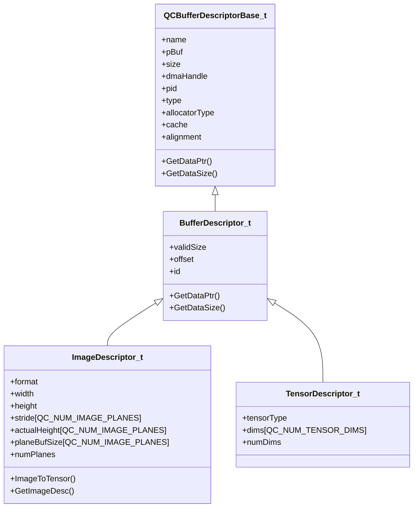
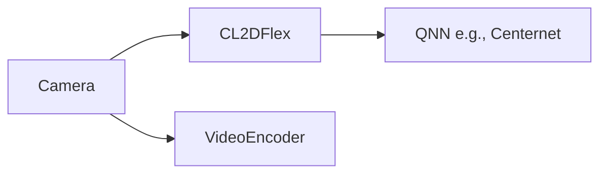
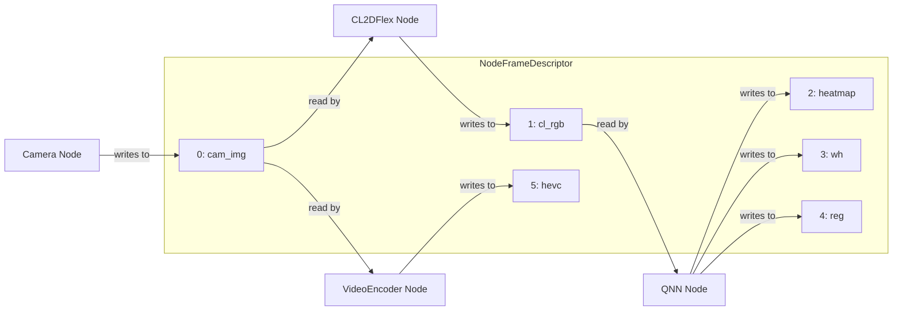

*Menu*:
- [1. QCNode Buffer Related Types](#1-qcnode-buffer-related-types)
  - [QCNode Buffer properties](#qcnode-buffer-properties)
    - [`BufferProps_t`](#bufferprops_t)
    - [`ImageBasicProps_t`](#imagebasicprops_t)
    - [`ImageProps_t`](#imageprops_t)
    - [`TensorProps_t`](#tensorprops_t)
    - [The details of image properties.](#the-details-of-image-properties)
  - [QCNode Buffer Descriptors](#qcnode-buffer-descriptors)
    - [The details of QCNode Buffer Descriptors.](#the-details-of-qcnode-buffer-descriptors)
    - [`BufferDescriptor_t`](#bufferdescriptor_t)
      - [Members](#members)
      - [Helper Methods](#helper-methods)
      - [Usage Scenarios](#usage-scenarios)
    - [`ImageDescriptor_t`](#imagedescriptor_t)
      - [Members](#members-1)
      - [Key Operations](#key-operations)
    - [`TensorDescriptor_t`](#tensordescriptor_t)
      - [Members](#members-2)
    - [Special Use Case: BEV AI Model](#special-use-case-bev-ai-model)
    - [Memory Allocation Recommendation](#memory-allocation-recommendation)
  - [QCNode Node Frame Descriptor](#qcnode-node-frame-descriptor)
    - [Global Buffer Mapping in NodeFrameDescriptor](#global-buffer-mapping-in-nodeframedescriptor)
    - [Example: Buffer Usage in a Simple QCNode Pipeline](#example-buffer-usage-in-a-simple-qcnode-pipeline)
      - [Camera Node](#camera-node)
      - [CL2DFlex Node](#cl2dflex-node)
      - [QNN Node (Centernet)](#qnn-node-centernet)
      - [VideoEncoder Node](#videoencoder-node)
    - [⚠️ Application Responsibility \& Limitations in Sample Code](#️-application-responsibility--limitations-in-sample-code)
- [2. QCNode buffer related APIs](#2-qcnode-buffer-related-apis)
  - [Buffer Allocation \& Deallocation](#buffer-allocation--deallocation)
  - [Buffer Access \& Helpers](#buffer-access--helpers)
  - [Image Operations](#image-operations)
  - [Platform Specific (Low-Level)](#platform-specific-low-level)
    - [QNX (PMEM)](#qnx-pmem)
    - [Linux (dma-buf)](#linux-dma-buf)
- [3. QCNode Buffer Descriptor Examples](#3-qcnode-buffer-descriptor-examples)
  - [3.1 A ImageDescriptor\_t image for BEV kind of AI model](#31-a-imagedescriptor_t-image-for-bev-kind-of-ai-model)
  - [3.2 Allocate buffers to hold images](#32-allocate-buffers-to-hold-images)
  - [3.3 Allocate Tensor](#33-allocate-tensor)
  - [3.4 Convert Image to Tensor](#34-convert-image-to-tensor)
    - [3.4.1 Convert the RGB Image to the Tensor](#341-convert-the-rgb-image-to-the-tensor)
    - [3.4.2 Convert the NV12/P010 Image to the Luma and Chroma Tensor](#342-convert-the-nv12p010-image-to-the-luma-and-chroma-tensor)

# 1. QCNode Buffer Related Types

## QCNode Buffer properties

These properties define the memory allocation strategy required to fulfill the specific needs of each QCNode. They guide the buffer manager in selecting the appropriate allocation method and configuring the buffer layout accordingly.

### `BufferProps_t`
[BufferProps_t](../include/QC/Infras/Memory/BufferDescriptor.hpp#L32) defines the most basic properties for a generic buffer.
*   `size`: The total required buffer size in bytes.
*   `allocatorType`: The type of allocator to use (default: `QC_MEMORY_ALLOCATOR_DMA`).
*   `cache`: Cache attributes (default: `QC_CACHEABLE`).
*   `alignment`: Alignment requirement.

### `ImageBasicProps_t`
[ImageBasicProps_t](../include/QC/Infras/Memory/ImageDescriptor.hpp#L37) defines the essential properties for an image buffer.
*   **Note**: The `size` member is ignored; size is calculated from image dimensions and format.
*   `width`: Image width in pixels.
*   `height`: Image height in pixels.
*   `format`: Image format (e.g., `QC_IMAGE_FORMAT_NV12`).
*   `batchSize`: Number of images (default: 1).

### `ImageProps_t`
[ImageProps_t](../include/QC/Infras/Memory/ImageDescriptor.hpp#L123) provides granular control over image memory layout, useful when dealing with specific stride or padding requirements.
*   Inherits from `ImageBasicProps_t`.
*   `stride[QC_NUM_IMAGE_PLANES]`: Stride in bytes for each plane.
*   `actualHeight[QC_NUM_IMAGE_PLANES]`: Total rows including padding.
*   `planeBufSize[QC_NUM_IMAGE_PLANES]`: Size of each plane buffer.
*   `numPlanes`: Number of planes.

### `TensorProps_t`
[TensorProps_t](../include/QC/Infras/Memory/TensorDescriptor.hpp#L34) defines properties for allocating tensor buffers.
*   **Note**: The `size` member is ignored; size is calculated from dimensions and type.
*   `tensorType`: Data type of tensor elements.
*   `dims[QC_NUM_TENSOR_DIMS]`: Dimensions of the tensor.
*   `numDims`: Number of valid dimensions.

### The details of image properties.

Due to hardware constraints, the actual buffer used to store an image may have alignment padding along its width and height. This padding is primarily required for zero-copy operations, enabling the buffer to be shared with the hardware accelerator. However, for an image with certain width and height, it can have no padding at all.

And the below picture shows a case what the actual buffer looks like for an image format such as NV12 that has 2 planes, the black area is padding space thus not valid pixels.


For each plane, it may have padding along width and height, it may also have padding between the 2 planes. And some extra padding is also needed at the end of the each plane.

And the below picture shows a case what's the actual buffer looks like for an image format such as RGB that has 1 plane.


Thus now, it's easy to understand those members of the type [ImageProps_t](../include/QC/Infras/Memory/ImageDescriptor.hpp#L113) except batchSize.

For the batchSize, it was generally designed for the BEV kind of AI models, check below section [3.1](#31-a-imagedescriptor_t-image-for-bev-kind-of-ai-model).

For the compressed image with the format H264 or H265, and the code [SANITY_CompressedImageAllocateByProps](../tests/unit_test/Infras/Memory/gtest_Memory.cpp#L346) which gives an example that how to allocate a buffer for a compressed image and this is the only way. And please note that for the compressed image, the member stride/actualHeight will be invalid and should not be used.

## QCNode Buffer Descriptors

The following descriptor types define the structure and metadata of buffers used by QCNode. Each descriptor corresponds to a specific buffer format and plays a critical role in managing memory and data layout.

  - [BufferDescriptor_t](../include/QC/Infras/Memory/BufferDescriptor.hpp#L93)
  - [ImageDescriptor_t](../include/QC/Infras/Memory/ImageDescriptor.hpp#L206)
  - [TensorDescriptor_t](../include/QC/Infras/Memory/TensorDescriptor.hpp#L94)

### The details of QCNode Buffer Descriptors.



### `BufferDescriptor_t`

The [`BufferDescriptor_t`](../include/QC/Infras/Memory/BufferDescriptor.hpp#L93) is the fundamental data structure used to represent a portion of DMA memory that can be shared between `QCNode` instances for **zero-copy** purposes.

It inherits from `QCBufferDescriptorBase_t` which represents the underlying allocated DMA memory block. `BufferDescriptor_t` adds the ability to reference a specific *subset* of that memory block.

#### Members
*   **Inherited from `QCBufferDescriptorBase_t`**:
    *   `pBuf`: The virtual base address of the DMA buffer.
    *   `size`: The total size of the allocated DMA buffer.
    *   `dmaHandle`: The handle for the DMA memory (e.g., from PMEM or dma-buf).
    *   `pid`: The process ID of the allocator.
    *   `type`: The buffer type (e.g., Image, Tensor).
    *   `allocatorType`: The allocator used (e.g., DMA, DMA_CAMERA).
    *   `cache`: Cache attributes (e.g., Cacheable, Non-cacheable).
    *   `alignment`: Memory alignment.
*   **Specific to `BufferDescriptor_t`**:
    *   `validSize`: The size of the *valid* data currently stored in the buffer. This can be smaller than or equal to `size`.
    *   `offset`: The starting byte offset of the valid data relative to `pBuf`.
    *   `id`: An optional user-assigned identifier.

#### Helper Methods
*   `GetDataPtr()`: Returns `(void*)((uint8_t*)pBuf + offset)`. This gives you the direct pointer to where the *valid* data starts.
*   `GetDataSize()`: Returns `validSize`.

#### Usage Scenarios
1.  **Entire Buffer**: Typically, `offset = 0` and `validSize = size`.
2.  **Sub-Buffer**: To share only a part of the buffer (e.g., the middle section of a large buffer), you adjust `offset` and `validSize` accordingly without re-allocating memory.

### `ImageDescriptor_t`

The [`ImageDescriptor_t`](../include/QC/Infras/Memory/ImageDescriptor.hpp#L206) extends `BufferDescriptor_t` to describe image data. It includes metadata necessary to interpret the raw memory as an image.

#### Members
*   `format`: The pixel format (e.g., `QC_IMAGE_FORMAT_NV12`, `QC_IMAGE_FORMAT_RGB`).
*   `width`: Image width in pixels.
*   `height`: Image height in pixels.
*   `batchSize`: Number of images in the batch.
*   `numPlanes`: Number of planes (e.g., 2 for NV12, 1 for RGB).
*   **Per-Plane Arrays** (sized `QC_NUM_IMAGE_PLANES`):
    *   `stride[]`: Byte stride (row pitch) for each plane.
    *   `actualHeight[]`: Number of scanlines (rows) including padding for each plane.
    *   `planeBufSize[]`: Size in bytes of each plane's buffer (`stride * actualHeight`).

#### Key Operations
*   **Image to Tensor Conversion**: 
    *   `ImageToTensor(TensorDescriptor_t &tensorDesc)`: Converts a single-plane image (like RGB) to a Tensor descriptor.
    *   `ImageToTensor(TensorDescriptor_t &luma, TensorDescriptor_t &chroma)`: Splits a multi-plane image (like NV12) into separate Tensor descriptors for Luma (Y) and Chroma (UV) planes.
*   **Batch Handling**:
    *   `GetImageDesc(...)`: Creates a new descriptor representing a subset of the image batch (e.g., extracting the middle image from a batch of 3).

### `TensorDescriptor_t`

The [`TensorDescriptor_t`](../include/QC/Infras/Memory/TensorDescriptor.hpp#L94) extends `BufferDescriptor_t` for multi-dimensional data arrays, primarily for AI model inputs/outputs.

#### Members
*   `tensorType`: The data type of the tensor elements (e.g., `QC_TENSOR_TYPE_FLOAT32`, `QC_TENSOR_TYPE_UINT8`).
*   `numDims`: Number of dimensions (rank).
*   `dims[]`: Array of dimension sizes (e.g., `[1, 224, 224, 3]`).

### Special Use Case: BEV AI Model

A notable exception occurs in the BEV (Bird’s Eye View) type AI model. In this scenario, the `ShareBufferMiddle` represents **only the middle portion** of the DMA memory.

For details, refer to section [3.1](#31-a-imagedescriptor_t-image-for-bev-kind-of-ai-model).

### Memory Allocation Recommendation

It is **strongly recommended** to use the APIs provided by the sample [`BufferManager`](../tests/sample/include/QC/sample/BufferManager.hpp#L56) for memory allocation and deallocation.

However, it is also acceptable to use platform-specific DMA-related APIs, such as:
- **PMEM** on QNX
- **dma-buf** on Linux

> ⚠️ In these cases, the user application is responsible for correctly assigning values to each member of the `BufferDescriptor_t`.

And in fact, the BufferManager APIs are based on the platform DMA related APIs (PMEM for QNX, dma-buf for Linux). 
  - For QNX, check [PMEMAllocator](../source/Infras/Memory/PMEMAllocator.cpp).
  - For Linux, check [DMABUFFAllocator](../source/Infras/Memory/DMABUFFAllocator.cpp).

```c
// For case that using PMEM or dma-buf to allocate memory,
// now have the virtual address pBuf and the uint64 dmaHandle.
// for QNX, the dmaHandle is cast from pmem_handle_t.
// for Linux, the dmaHandle is cast from int.

ImageDescriptor_t imgDesc;

imgDesc.pBuf = pBuf;
imgDesc.dmaHandle = dmaHandle;
imgDesc.size = size;
imgDesc.pid = static_cast<uint64_t>( getpid() );
imgDesc.allocatorType = QC_MEMORY_ALLOCATOR_DMA;
imgDesc.cache = QC_CACHEABLE;
imgDesc.alignment = 4096;
imgDesc.validSize = size;
imgDesc.offset = 0;
imgDesc.type = QC_BUFFER_TYPE_IMAGE;
imgDesc.imgProps.format = format;
imgDesc.imgProps.batchSize = batchSize;
imgDesc.imgProps.width = width;
imgDesc.imgProps.height = height;
imgDesc.imgProps.numPlanes = numPlanes;
imgDesc.imgProps.stride[0] = stride0;
imgDesc.imgProps.actualHeight[0] = actualHeight0;
imgDesc.imgProps.planeBufSize[0] = stride0*actualHeight0;
...
imgDesc.imgProps.stride[numPlanes-1] = strideX;
imgDesc.imgProps.actualHeight[numPlanes-1] = actualHeightX;
imgDesc.imgProps.planeBufSize[numPlanes-1] = strideX*actualHeight;

// and then this can be feed into a QCNode
```

And another thing, the Buffer Descriptor can be shared between QCNode, but it has no life cycle management ability. Here, the QCNode Sample Application has a demo that using C++ std::shared_ptr to demonstrate that how to do the buffer life cycle management between the nodes that running in the same process but in different threads, refer [The QCNode Sample Buffer Life Cycle Management](./sample-buffer-life-cycle-management.md).

## QCNode Node Frame Descriptor

NodeFrameDescriptor is a concrete implementation of QCFrameDescriptorNodeIfs used by QCNode. It encapsulates a collection of buffer descriptors that represent DMA-accessible memory regions for raw data, images, or tensors.

The role of each buffer descriptor in `NodeFrameDescriptor`—whether it serves as an input, output, or parameter—is determined by the specific QCNode implementation based on its buffer index, referred to as `globalBufferId`.

  - [NodeFrameDescriptor](../include/QC/Node/NodeFrameDescriptor.hpp#L44)
    - [GetBuffer](../include/QC/Node/NodeFrameDescriptor.hpp#L93)
    - [SetBuffer](../include/QC/Node/NodeFrameDescriptor.hpp#L109)
    - [Clear](../include/QC/Node/NodeFrameDescriptor.hpp#L127)

### Global Buffer Mapping in NodeFrameDescriptor

The user application can implement its own version of `NodeFrameDescriptor` tailored to its specific needs. The QCNode framework is designed to support a model where a **single `NodeFrameDescriptor` instance** is shared across multiple nodes in a processing pipeline. In this design, each node must know which buffer indices—referred to as `globalBufferId`s—it should interact with. This mapping of buffer roles (e.g., input, output, parameter) is defined in a **global buffer map**, which should be provided to each node during the initialization phase via a **JSON configuration string**.

### Example: Buffer Usage in a Simple QCNode Pipeline

Consider a simple pipeline:



In this setup, we can define a shared `NodeFrameDescriptor` with the following buffer layout:

```
[cam_img, cl_rgb, heatmap, wh, reg, hevc]
```



#### Camera Node
- **Buffer Index 0 (`cam_img`)**:  
  The Camera node writes its output image to this buffer.

#### CL2DFlex Node
- **Input**:
  Reads from **buffer index 0**, which contains the image produced by the Camera.
- **Output**:
  Writes the preprocessed RGB image to **buffer index 1 (`cl_rgb`)**.

#### QNN Node (Centernet)
- **Input**:
  Reads from **buffer index 1**, the RGB image produced by CL2DFlex.
- **Outputs**:
  - **Buffer index 2 (`heatmap`)**: Centernet heatmap output  
  - **Buffer index 3 (`wh`)**: Width-height regression output  
  - **Buffer index 4 (`reg`)**: Offset regression output
- For details, refer [QNN globalBufferIdMap configuration](../include/QC/Node/QNN.hpp#L118)

#### VideoEncoder Node
- **Input**:
  Reads from **buffer index 0**, which contains the image produced by the Camera.
- **Output**:
  Writes the compressed hevc image to **buffer index 5 (`hevc`)**.

### ⚠️ Application Responsibility & Limitations in Sample Code

To correctly use a shared `NodeFrameDescriptor` across multiple QCNodes in a pipeline, the **application must be aware of the graph topology**—specifically, the number of buffer descriptors required and their roles (input, output, parameter) at each stage. This knowledge is essential to correctly size and populate the `NodeFrameDescriptor`.

In the current QCNode source code, the **`QCNodeSampleApp` does not support this shared descriptor model**. Instead, each sample application demonstrates a single QCNode in isolation, using a `NodeFrameDescriptor` that contains **only the buffer descriptors relevant to that specific node**.

As a result:
- The shared buffer model is not demonstrated in the sample apps.
- Developers integrating multiple nodes must manually manage the buffer layout and ensure consistency across nodes.
- The global buffer map must be defined and passed during initialization, but this feature is **not yet fully supported by all QCNode implementations**.

---

# 2. QCNode buffer related APIs

## Buffer Allocation & Deallocation
The `BufferManager` class is the primary interface for managing DMA buffers.

*   **[BufferManager::Allocate](../tests/sample/include/QC/sample/BufferManager.hpp#L55)**
    *   This API performs buffer allocation based on the input properties (`BufferProps_t`, `ImageBasicProps_t`, etc.).
    *   Internally delegates to specialized private methods:
        *   `AllocateBinary`: For generic raw buffers.
        *   `AllocateBasicImage`: For images with standard alignment.
        *   `AllocateImage`: For images with specific stride/padding.
        *   `AllocateTensor`: For tensor buffers.
*   **[BufferManager::Free](../tests/sample/include/QC/sample/BufferManager.hpp#L62)**
    *   Releases the allocated buffer.

## Buffer Access & Helpers
Methods to access data and properties within a descriptor.

*   **[BufferDescriptor::GetDataPtr](../include/QC/Infras/Memory/BufferDescriptor.hpp#L119)**
    *   Returns a `void*` pointer to the **valid data** in the buffer (accounts for `offset`).
*   **[BufferDescriptor::GetDataSize](../include/QC/Infras/Memory/BufferDescriptor.hpp#L130)**
    *   Returns the size of the **valid data** (returns `validSize`).

## Image Operations
Specialized operations for `ImageDescriptor_t`.

*   **[ImageDescriptor::GetImageDesc](../include/QC/Infras/Memory/ImageDescriptor.hpp#L269)**
    *   Creates a new descriptor representing a subset of an image batch (e.g., specific frames from a batch).
*   **[ImageDescriptor::ImageToTensor](../include/QC/Infras/Memory/ImageDescriptor.hpp#L249)**
    *   Converts a 1-plane image (e.g., RGB) to a single `TensorDescriptor_t`.
*   **[ImageDescriptor::ImageToTensor](../include/QC/Infras/Memory/ImageDescriptor.hpp#L258)**
    *   Converts a 2-plane image (e.g., NV12) to two separate `TensorDescriptor_t`s (Luma and Chroma).

## Platform Specific (Low-Level)
Utilities for mapping DMA memory across processes.

### QNX (PMEM)
*   **[MemoryMap](../include/QC/Infras/Memory/PMEMUtils.hpp#L43)**: Map a DMA memory handle from another process.
*   **[MemoryUnMap](../include/QC/Infras/Memory/PMEMUtils.hpp#L53)**: Unmap the memory.

### Linux (dma-buf)
*   **[MemoryMap](../include/QC/Infras/Memory/DMABUFFUtils.hpp#L42)**: Map a DMA-BUF file descriptor from another process.
*   **[MemoryUnMap](../include/QC/Infras/Memory/DMABUFFUtils.hpp#L52)**: Unmap the memory.
  
# 3. QCNode Buffer Descriptor Examples

For an ADAS perception application, the buffers are generally allocated during the initialization phase and then on ping-pong used during running, and only will be released when the application exit.

## 3.1 A ImageDescriptor_t image for BEV kind of AI model

Generally, for the BEV kind of AI models, it was that multiple cameras’ frame are preprocessed and saved into 1 RGB buffer, and generally it was 6 or 7 cameras, but here gives an example with 3 cameras case.


The [SANITY_ImageAllocateRGBByProps](../tests/unit_test/Infras/Memory/gtest_Memory.cpp#L299) demonstrate that how to allocate such a batched image(batchSize=3), the imgDescAll will represent the whole buffer that contain the 3 RGB images. And use the API [GetImageDesc](../include/QC/Infras/Memory/ImageDescriptor.hpp#L269) to get a shared buffer descriptor imgDescMiddle to represent the middle front camera RGB image.

Thus, the imgDescAll can be feed into the BEV kind of the AI models, and the imgDescMiddle can be feed into a traffic light detection AI model for example, thus for the traffic light detection AI model, it doesn't need another pre-processing to convert the front camera frame to RGB, just reused the middle portion of the imgDescAll to save computing resource.


## 3.2 Allocate buffers to hold images

The [SANITY_ImageAllocateByWHF](../tests/unit_test/Infras/Memory/gtest_Memory.cpp#L105) demonstrate that how to allocate 1 camera buffer for format UYVY or NV12, it was through using API "[Allocate](../tests/sample/include/QC/sample/BufferManager.hpp#L55)" to allocate an image with the best alignment that can be shared between CPU/GPU/VPU/HTP, etc.

But if want to allocate a list of ping-pong buffers, the usage is generally as below.

```c++
class AUserClass
{
public:
    QCStatus_e Init( void )
    {
        QCNodeID_t nodeId;
        nodeId.name = "DEMO"; /* the name must be unique */
        nodeId.id = 0;        /* the nodeId must be unique */
        nodeId.type = QC_NODE_TYPE_CL_2D_FLEX; /* use the correct type accordingly */
        m_pBufMgr = BufferManager::Get( nodeId );
        QCStatus_e ret = QC_STATUS_OK;
        // allocate the 4 ping-pong buffers
        for ( int i = 0; ( i < 4 ) && ( QC_STATUS_OK == ret ); i++ )
        {
            ret = m_pBufMgr->Allocate( ImageBasicProps_t( 3840, 2160, QC_IMAGE_FORMAT_NV12 ), m_buffers[i] );
        }
        // init the QCNode CL2DFlex
        return ret;
    }

    QCStatus_e Run( ImageDescriptor_t &input )
    {
        QCSharedFrameDescriptorNode frameDesc( 2 );
        ImageDescriptor_t &output = m_buffers[m_index];
        // for each run, ping-pong use each buffer
        // do process of the pInput, such as using CL2DFlex to do color conversion from UYVY to NV12
        frameDesc.SetBuffer( 0, input );
        frameDesc.SetBuffer( 1, output );
        ret = cl2dflex.ProcessFrameDescriptor( frameDesc );
        m_index++;
        if ( m_index > 4 )
        {
            m_index = 0;
        }
    }

    QCStatus_e Deinit( void )
    {
        QCStatus_e ret = QC_STATUS_OK;

        // release the 4 ping-pong buffers
        for ( int i = 0; ( i < 4 ) && ( QC_STATUS_OK == ret ); i++ )
        {
            ret = m_pBufMgr->Free( m_buffers[i] );
        }

        BufferManager::Put(m_pBufMgr);
        m_pBufMgr = nullptr;

        return ret;
    }

private:
    CL2DFlex m_cl2d;
    ImageDescriptor_t m_buffers[4];   // A case that want 4 ping-pong buffers.
    BufferManager *m_pBufMgr = nullptr;
    uint32_t m_index = 0;
}
```

But consideration of the life cycle management, the implementation will be totally different for the sharing between threads in the same process or between processes.

And the QCNode Sample [SharedBufferPool](../tests/sample/include/QC/sample/SharedBufferPool.hpp#L126) gives a demo that how to create a ping-pong buffer pool that the buffer can be shared between threads in the process, for more details, check [The QCNode Sample Buffer Life Cycle Management](./sample-buffer-life-cycle-management.md).

## 3.3 Allocate Tensor

The [SANITY_TensorAllocate](../tests/unit_test/Infras/Memory/gtest_Memory.cpp#L371) demonstrate that how to allocate buffer for Tensor.


## 3.4 Convert Image to Tensor

Here for the node QNN, the inputs/outputs of this node must be Tensor not Image. So the shared buffer Image must be converted into Tensor.

### 3.4.1 Convert the RGB Image to the Tensor

For QNN with RGB or normalized RGB as input, here this API [ImageToTensor](../include/QC/Infras/Memory/ImageDescriptor.hpp#L249) can be used to convert the RGB Image to a Tensor.

- Refer [SampleQnn ThreadMain](../tests/sample/source/SampleQnn.cpp#L320).
- Refer [gtest SANITY_ImageAllocateByWHF](../tests/unit_test/Infras/Memory/gtest_Memory.cpp#L105).

### 3.4.2 Convert the NV12/P010 Image to the Luma and Chroma Tensor

For QNN with NV12 or P010 as input, here this API [ImageToTensor](../include/QC/Infras/Memory/ImageDescriptor.hpp#L258) can be used to convert the NV12/P010 Image to the Luma and Chroma Tensor.

- Refer [gtest L2_Image2Tensor](../tests/unit_test/Infras/Memory/gtest_Memory.cpp#L1005).
