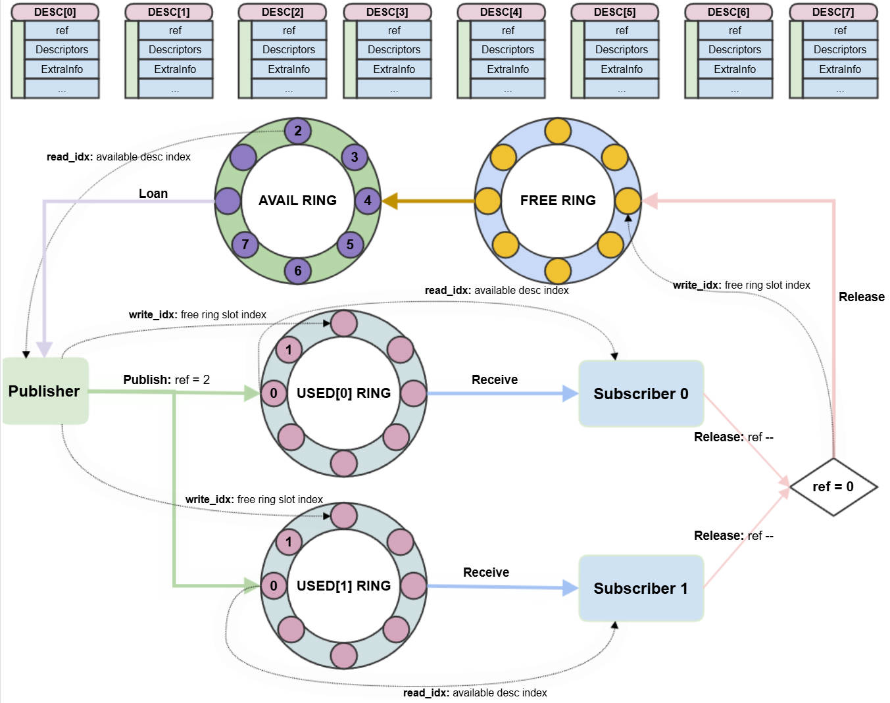
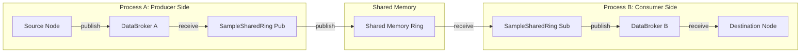

*Menu*:
- [1. QCNode buffer life cycle management between threads in the same process](#1-qcnode-buffer-life-cycle-management-between-threads-in-the-same-process)
  - [1.1 Using C++ std::shared\_ptr to do the QCNode buffer life cycle management](#11-using-c-stdshared_ptr-to-do-the-qcnode-buffer-life-cycle-management)
    - [1.1.1 The buffer life cycle management for Camera](#111-the-buffer-life-cycle-management-for-camera)
    - [1.1.2 The buffer life cycle management for the Video Encoder](#112-the-buffer-life-cycle-management-for-the-video-encoder)
    - [1.1.3 The buffer life cycle management of the SharedBufferPool](#113-the-buffer-life-cycle-management-of-the-sharedbufferpool)
- [2. QCNode buffer life cycle management between processes](#2-qcnode-buffer-life-cycle-management-between-processes)
  - [2.1 Shared Ring Mechanism](#21-shared-ring-mechanism)
  - [2.2 The Life Cycle Flow](#22-the-life-cycle-flow)
    - [Step 1: Publisher Publish](#step-1-publisher-publish)
    - [Step 2: Subscriber Receive](#step-2-subscriber-receive)
    - [Step 3: Subscriber Release](#step-3-subscriber-release)
    - [Step 4: Publisher Reclaim](#step-4-publisher-reclaim)
  - [2.3 The Data Pipeline View](#23-the-data-pipeline-view)

# 1. QCNode buffer life cycle management between threads in the same process

## 1.1 Using C++ std::shared_ptr to do the QCNode buffer life cycle management

The [QCNode Sample Application](../tests/sample/README.md) is an application to demonstrate how to use the QCNode nodes. And here this document will introduce the buffer life cycle management that used by the QCNode Sample Application by using the C++ [std::shared_ptr](https://en.cppreference.com/w/cpp/memory/shared_ptr).

Generally, by customization of the "Deleter" function of the std::shared_ptr to do the buffer release at the end of its life cycle.

```c++
std::shared_ptr<SharedBuffer_t> buffer( pSharedBuffer, [&]( SharedBuffer_t *pSharedBuffer ) {
    // within the customized Deleter to do the specified buffer release action
} );
```

Note: As the QCNode Sample is a demo, it still has memory allocation during running after the initialization which was not good, for example for the above std::shared_ptr "buffer" construction, it's strongly suggested that to customize the allocation of the std::shared_ptr by using a std::shared_ptr allocation memory pool, refer [Allocator](https://en.cppreference.com/w/cpp/named_req/Allocator).

And as below 2 pictures shows, the C++ std::shared_ptr will be a part of the message that to be published by the single producer and can be received by the 1 or multiple consumers, thus it can ensure that when the last consumer release the std::shared_ptr, the customized "Deleter" function will be called to do the specified buffer release action.


### 1.1.1 The buffer life cycle management for Camera

Refer [SampleCamera::ProcessDoneCb](../tests/sample/source/SampleCamera.cpp#L15), when this callback from the Camera is called, it means that a **camera frame is ready**.

- This will finally **activate the related thread** to call [SampleCamera::ProcessFrame](../tests/sample/source/SampleCamera.cpp#L278).
- `ProcessFrame` will then **publish the camera frame info out** using the **QCNode DataBroker message queue**, allowing subscribers to consume it asynchronously.

```c++
void SampleCamera::ProcessFrame( CameraFrameDescriptor_t *pCamFrameDesc )
{
    DataFrames_t frames;
    DataFrame_t frame;
    uint32_t streamId = pCamFrameDesc->streamId;

    SharedBuffer_t *pSharedBuffer = new SharedBuffer_t;
    pSharedBuffer->SetBuffer( *pCamFrameDesc );
    pSharedBuffer->pubHandle = (uint64_t) pCamFrameDesc->frameIdx + ( (uint64_t) streamId << 32 );

    std::shared_ptr<SharedBuffer_t> buffer( pSharedBuffer, [&]( SharedBuffer_t *pSharedBuffer ) {
        CameraFrameDescriptor_t camFrameDesc;
        NodeFrameDescriptor frameDesc( 1 );

        uint32_t frameIdx = pSharedBuffer->pubHandle & 0xFFFFFFFFul;
        camFrameDesc = pSharedBuffer->imgDesc;
        camFrameDesc.frameIdx = frameIdx;
        camFrameDesc.streamId = pSharedBuffer->pubHandle >> 32;
        (void) frameDesc.SetBuffer( 0, camFrameDesc );

        ...
            m_camera.ProcessFrameDescriptor( frameDesc );
        ...

        delete pSharedBuffer;
    } );
    ...
    m_pub.Publish( frames );
}
```

### 1.1.2 The buffer life cycle management for the Video Encoder

Refer [SampleVideoEncoder::ThreadMain](../tests/sample/source/SampleVideoEncoder.cpp#L173) which will hold the shared camera buffer in the "m_camFrameMap" after successfully submit the camera frame to the Video Encoder.

```c++
void SampleVideoEncoder::ThreadMain()
{
    QCStatus_e ret;
    while ( false == m_stop )
    {
        DataFrames_t frames;
        DataFrame_t frame;
        ret = m_sub.Receive( frames );
        if ( 0 == ret )
        {
            frame = frames.frames[0];
            ...
            {
                std::lock_guard<std::mutex> l( m_lock );
                m_camFrameMap[frame.frameId] = frame;
                // hold the shared camera frame until the callback "InFrameCallback"
            }
            ...
            ret = m_encoder.ProcessFrameDescriptor( frameDesc );
            ...
        }
    }
}
```

Refer [SampleVideoEncoder::InFrameCallback](../tests/sample/source/SampleVideoEncoder.cpp#L33), when this callback from the Video Encoder is called, it means that the **shared camera frame is fully consumed by the Video Encoder**.

- This will then **activate the related thread** to erase the shared camera frame from `m_camFrameMap`.
- By erasing the entry, the camera frame is **released back to the Camera** for reuse.


```c++
void SampleVideoEncoder::ThreadProcMain()
{
    ...
    auto it = m_camFrameMap.find( frameId );
    if ( it != m_camFrameMap.end() )
    {   /* release the input camera frame */
        m_camFrameMap.erase( frameId );
    }
    ...
}
```

Refer [SampleVideoEncoder::OutFrameCallback](../tests/sample/source/SampleVideoEncoder.cpp#L48), when this callback from the Video Encoder is called, it means that an **encoded video frame is ready**.

```c++
void SampleVideoEncoder::OutFrameCallback( VideoFrameDescriptor &outFrame )
{
    ...
    DataFrames_t frames;
    DataFrame_t frame;

    SharedBuffer_t *pSharedBuffer = new SharedBuffer_t;
    pSharedBuffer->SetBuffer( outFrame );
    pSharedBuffer->pubHandle = 0;
    ...
    std::shared_ptr<SharedBuffer_t> buffer( pSharedBuffer, [&]( SharedBuffer_t *pSharedBuffer ) {
        VideoFrameDescriptor buffDesc;
        buffDesc = pSharedBuffer->GetBuffer();

        NodeFrameDescriptor frameDesc( QC_NODE_VIDEO_ENCODER_OUTPUT_BUFF_ID + 1 );
        frameDesc.SetBuffer( QC_NODE_VIDEO_ENCODER_OUTPUT_BUFF_ID, buffDesc );

        m_encoder.ProcessFrameDescriptor( frameDesc );
        delete pSharedBuffer;
    } );
    ...
        m_pub.Publish( frames );
    ...
}
```

### 1.1.3 The buffer life cycle management of the SharedBufferPool

The QCNode Sample [SharedBufferPool](../tests/sample/include/QC/sample/SharedBufferPool.hpp#L168) gives a demo that how to create a ping-pong buffer pool that the buffer can be shared between threads in the process. It was by using a flag ["dirty"](../tests/sample/include/QC/sample/SharedBufferPool.hpp#L282) for each buffer to indicate whether the buffer is in use(dirty = true) or free (dirty = false).

Here it was the ["Get"](../tests/sample/source/SharedBufferPool.cpp#L43) API to try to get a free buffer from the pool, as the code shows, if no buffer's flag "dirty" is false, a nullptr will be returned to indicate that all buffers are in busy state which means still hold in the DataBroker queue or hold by the consumers.

```c++
std::shared_ptr<SharedBuffer_t> SharedBufferPool::Get()
{
    ...

    uint32_t idx = 0;
    auto it = m_queue.begin();
    for ( ; it != m_queue.end() && __atomic_load_n( &it->dirty, __ATOMIC_RELAXED ); it++, idx++ )
    {
    }

    if ( it == m_queue.end() )
    {
        ...
        return nullptr;
    }
    __atomic_store_n( &it->dirty, true, __ATOMIC_RELAXED );
    ...
    std::shared_ptr<SharedBuffer_t> ptr( &it->sharedBuffer,
                                         [&]( SharedBuffer_t *p ) { Deleter( p ); } );
    return ptr;
}
```

Please note the Get API is not thread safe, this API must be ensured to be only called by only 1 producer in 1 thread only.

Here it's ["Deleter" function](../tests/sample/source/SharedBufferPool.cpp#L63) that to release the buffer back to the pool.

```c++
void SharedBufferPool::Deleter( SharedBuffer_t *ptrToDelete )
{
    ...
    __atomic_store_n( &m_queue[ptrToDelete->pubHandle].dirty, false, __ATOMIC_RELAXED );
    ...
}
```

And refer the [SampleRemap](../tests/sample/source/SampleRemap.cpp#L206) or [SampleQnn](../tests/sample/source/SampleQnn.cpp#L128) to know how to use this SharedBufferPool.


# 2. QCNode buffer life cycle management between processes




When sharing buffers between processes, the C++ `std::shared_ptr` cannot be directly shared because it is a process-local object. However, the lifecycle management concept remains similar: the buffer should not be released until all consumers (local and remote) have finished using it.

To achieve this across process boundaries, the **SharedRing** mechanism is used (demonstrated in [SampleSharedRing](../tests/sample/source/SampleSharedRing.cpp)). This implementation is based on the Linux **virtio** ring buffer concept but extended to support **1-Publisher to Multi-Subscriber** multicast scenarios.

## 2.1 Shared Ring Mechanism

The Shared Ring uses shared memory to maintain the state of buffer descriptors. It consists of three types of rings:

1.  **Avail Ring**: Holds free descriptors that are available for the **Publisher** to use for sending new data.
2.  **Used Ring(s)**: Holds descriptors that contain valid data waiting to be processed by **Subscribers**. To support multiple subscribers, there is a dedicated **Used Ring for each subscriber** (e.g., `used[0]`, `used[1]`, ...).
3.  **Free Ring**: Holds descriptors that have been fully consumed by all subscribers and are ready to be recycled by the Publisher.

Each descriptor [(SharedRing_Desc_t)](../tests/sample/include/QC/sample/shared_ring/SharedRing.hpp#L118) in the shared memory contains an **atomic reference counter** (`ref`), which is crucial for the lifecycle management.

## 2.2 The Life Cycle Flow

The lifecycle management across processes involves coordination between the Publisher and Subscribers using the rings and the atomic reference counter.

### Step 1: Publisher Publish
- Refer `SharedPublisher::Publish` in [SharedPublisher.cpp](../tests/sample/Library/SharedRing/source/SharedPublisher.cpp).

1.  **Get Descriptor**: The Publisher pops a free descriptor index (`idx`) from the **Avail Ring**.
2.  **Hold Reference**: It stores the `DataFrames_t` (containing the local `std::shared_ptr`) into a local map `m_dataFrames[idx]`. This keeps the buffer alive in the producer process.
3.  **Init Counter**: It initializes the descriptor's atomic reference counter (`ref`) to the **number of subscribers** (e.g., if there are 2 subscribers, `ref = 2`).
4.  **Distribute**: It pushes the `idx` to the **Used Ring** of *each* subscriber and signals them.

### Step 2: Subscriber Receive
- Refer `SharedSubscriber::Receive` in [SharedSubscriber.cpp](../tests/sample/Library/SharedRing/source/SharedSubscriber.cpp).

1.  **Get Data**: The Subscriber pops the `idx` from its dedicated **Used Ring**.
2.  **Create Local Shared Pointer**: It creates a new local `std::shared_ptr` for the received buffer.
3.  **Custom Deleter**: This `std::shared_ptr` is configured with a custom deleter [(`ReleaseSharedBuffer`)](../tests/sample/Library/SharedRing/source/SharedSubscriber.cpp#L220) that is responsible for signaling completion.

### Step 3: Subscriber Release
- Refer [SharedSubscriber::ReleaseSharedBuffer](../tests/sample/Library/SharedRing/source/SharedSubscriber.cpp#L220).

1.  **Usage Done**: When the subscriber application finishes using the buffer, the local `std::shared_ptr` is destroyed, triggering the custom deleter.
2.  **Decrement Counter**: The deleter atomically decrements the global reference counter (`ref`) in the shared memory descriptor.
3.  **Recycle**: If the counter reaches **0** (meaning this was the last subscriber to release the buffer), the Subscriber pushes the `idx` to the **Free Ring** and signals the Publisher.

### Step 4: Publisher Reclaim
- Refer [SharedPublisher::ThreadMain](../tests/sample/Library/SharedRing/source/SharedPublisher.cpp#L205).

1.  **Monitor**: The Publisher's thread waits for signals on the **Free Ring**.
2.  **Reclaim**: When an `idx` appears in the Free Ring, it means all remote consumers are done.
3.  **Release Reference**: The Publisher removes the entry from `m_dataFrames[idx]`. This destroys the local `std::shared_ptr`.
4.  **Final Cleanup**: If this was the last reference (i.e., producer is also done), the original custom deleter (from Section 1) runs, and the buffer is returned to the source (e.g., Camera).
5.  **Reuse**: The `idx` is pushed back to the **Avail Ring** for future use.

## 2.3 The Data Pipeline View

The [SampleSharedRing](../tests/sample/source/SampleSharedRing.cpp) application functions as a bridge to connect DataBrokers across different processes using the Shared Ring mechanism.



**Process A (Producer Side)**:
1.  **Source Node** (e.g., Camera) publishes a frame to the local DataBroker.
2.  **SampleSharedRing (Publisher Mode)**:
    -   Its **DataBroker Subscriber** (`m_sub`) receives the frame (as a `std::shared_ptr`).
    -   Its **SharedRing Publisher** (`m_sharedPub`) publishes this frame to the inter-process Shared Ring (as described in Sec 2.2 Step 1).

**Process B (Consumer Side)**:
1.  **SampleSharedRing (Subscriber Mode)**:
    -   Its **SharedRing Subscriber** (`m_sharedSub`) receives the frame from the Shared Ring (as described in Sec 2.2 Step 2).
    -   Its **DataBroker Publisher** (`m_pub`) publishes this frame (wrapped in a new local `std::shared_ptr`) to the local DataBroker.
2.  **Destination Node** (e.g., Video Encoder) subscribes to the local DataBroker and consumes the frame.

This pipeline ensures that the buffer lifecycle is maintained from the Source Node in Process A, through the Shared Ring, to the Destination Node in Process B, and back, preventing premature release at any stage.
